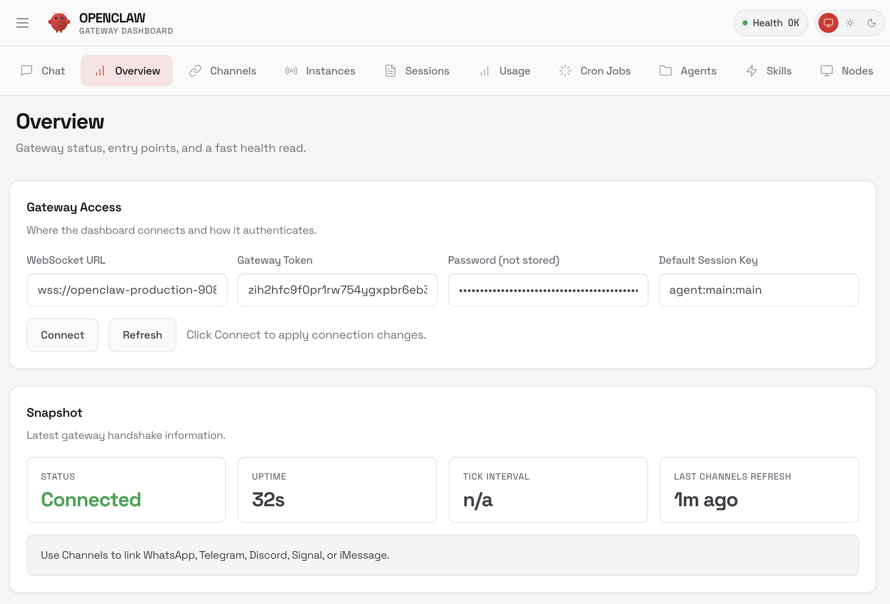

# OpenClaw on Railway

Self-hosted [OpenClaw](https://openclaw.ai) deployment with Go toolchain and persistent storage.

OpenClaw is a personal AI assistant platform that runs a gateway server on Node.js. The gateway acts as a control plane — it bridges multiple messaging channels (WhatsApp, Telegram, Discord, Slack, Signal, and more) into a unified interface, routing messages between channels and the AI agent runtime via WebSocket.

## Deploy

## What's included

- OpenClaw gateway (installed via public install script)
- Go runtime for running Go-based tools
- Persistent volume at `/data` for state, workspace, Go binaries, and npm modules

## Security

The container runs as a non-root user with hardened volume permissions, a restrictive umask, and binary integrity verification on startup.

## What it looks like

## Setup

OpenClaw requires Claude authentication to chat with Claude. You can authenticate using either:

### Option 1: Claude Web Session (Recommended)

1. In the Railway dashboard, open your OpenClaw service
2. Go to **Variables**
3. Add one of the following:
   - `CLAUDE_AI_SESSION_KEY` - Your Claude AI session key
   - `CLAUDE_WEB_SESSION_KEY` and `CLAUDE_WEB_COOKIE` - Your Claude web session credentials
4. Redeploy the service

To get your Claude session credentials, log into [claude.ai](https://claude.ai) and extract the session key from your browser's developer tools (Application/Storage > Cookies).

### Option 2: Anthropic API Key

Alternatively, you can use an Anthropic API key:

1. In the Railway dashboard, open your OpenClaw service
2. Go to **Variables**
3. Add `ANTHROPIC_API_KEY` with your key from [console.anthropic.com](https://console.anthropic.com/)
4. Redeploy the service

## Connecting to the gateway

The template auto-generates `OPENCLAW_GATEWAY_TOKEN` and `OPENCLAW_GATEWAY_PASSWORD` for you. To find them:

1. In the Railway dashboard, open your OpenClaw service
2. Go to **Variables**
3. Copy `OPENCLAW_GATEWAY_TOKEN` or `OPENCLAW_GATEWAY_PASSWORD`

Use the token or password to authenticate on the dashboard `/overview` page when connecting to your gateway.

## Environment variables

| Variable | Description |
|---|---|
| `CLAUDE_AI_SESSION_KEY` | Claude AI session key (recommended authentication method) |
| `CLAUDE_WEB_SESSION_KEY` | Claude web session key (alternative to CLAUDE_AI_SESSION_KEY) |
| `CLAUDE_WEB_COOKIE` | Claude web cookie (used with CLAUDE_WEB_SESSION_KEY) |
| `ANTHROPIC_API_KEY` | Anthropic API key for Claude (alternative authentication method) |
| `OPENCLAW_GATEWAY_TOKEN` | Auto-generated token for gateway authentication |
| `OPENCLAW_GATEWAY_PASSWORD` | Auto-generated password for gateway authentication |
| `PORT` | Automatically set by Railway |
